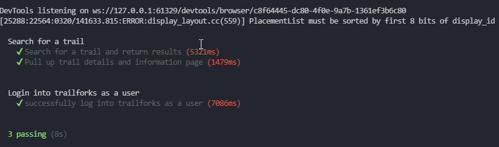

# Trailforks Selenium Test Scripts 

  ## About/Description

  
  Trailforks is a web application and mobile application created originally to help map mountain bike trails using GPS.  This allows users to search for trails near where they live, check conditions, find the best routes associated with those trails and many other features.  
  
  I selected this website as an example for a test plan and then wrote a few basic scripts using Selenium and Mocha.  These are some basic scripts that only test a few simple features such as logging in or search for a trail.

  Selenium runs the Javascript and the uses the built in Node assertions for validations which is then reported to the command line with Mocha.   

  View Page Here: https://www.trailforks.com/

  ## Table of Contents

  * [Installation](#installation)
  * [Usage](#usage)
  * [Languages](#languages)
  * [Contributing](#contributing)
  * [Questions](#questions)
  
  ## Installation

  These scripts are written with Javascript and require Node.js to run the npm install command which will download the necessary packages to run.

  Once the packages are installed, npm test is the command required to kick off the tests.

  ## Usage

  These are some very basic tests of a publicly available website.

  ### Screenshots of App

  

 

  ## Languages

  * Javascript
  * Selenium
  * Mocha
  

  ## Contributing

  Contributions by: David Shaw

  ## License

  https://choosealicense.com/licenses/mit/

  ## Questions:

  If you have any questions please contact us or refer to our github below:

  Email Us At: david.shaw1242@gmail.com

  Github Repo: https://github.com/ds1242/webpage-test